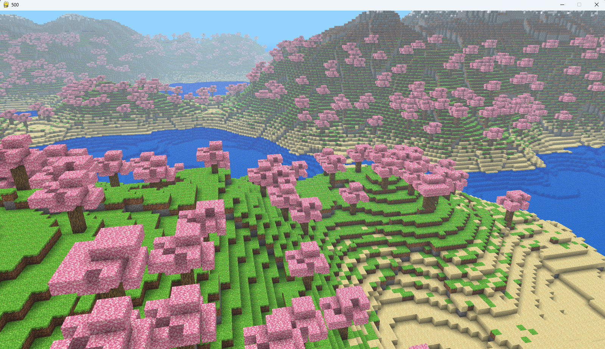

# Voxel Engine

A voxel-based 3D engine built using Python with ModernGL and Pygame. Inspired by Minecraft-like mechanics, this engine features terrain generation, chunk mesh rendering, raycasting for interaction, water planes, clouds, and ambient occlusion shading.



## Features

- **Procedural Terrain Generation** using noise functions (OpenSimplex)
- **Chunked World System** with frustum culling and dynamic mesh rebuilding
- **Raycasting** for placing/removing blocks
- **Ambient Occlusion Shading** for more realistic lighting on block faces
- **Water Planes** and animated **Clouds**
- **Texture Atlas Support** for efficient rendering

## Technologies Used

- Python 3.11.x
- ModernGL - OpenGL context management
- Pygame - Windowing, input handling, and asset loading
- Numba - Accelerated procedural generation and mesh building
- GLM - Math operations (vectors, matrices, etc.)

## Project Structure


## Controls

| Action            | Control               |
|-------------------|-----------------------|
| Move Forward      | W                     |
| Move Backward     | S                     |
| Move Left         | A                     |
| Move Right        | D                     |
| Move Up           | Q                     |
| Move Down         | E                     |
| Look Around       | Mouse movement        |
| Place Block       | Right mouse click     |
| Remove Block      | Left mouse click      |
| Switch Mode       | ESC or right-click    |


### Key Components Explained:

- **Shaders/**: Contains all GLSL shader programs for different rendering effects
- **Assets/**: Stores textures and other game resources
- **Core Modules**:
  - `world.py`: Handles the voxel world state and chunk management
  - `player.py`: Implements first-person camera controls
  - `terrain_gen.py`: Generates procedural terrain using noise algorithms
- **Mesh System**:
  - Custom mesh builders for chunks, clouds, and water surfaces
  - Optimized geometry generation using Numba acceleration
- **Rendering Pipeline**:
  - ModernGL-based rendering system
  - Separate shader programs for different material types
  - Ambient occlusion and special effects


## Installation

### Requirements

- Python 3.11.x
- Libraries: moderngl, pygame, numpy, numba, glm

### Setup Instructions

1. Clone the repository:
```bash
git clone https://github.com/arjunfps/voxel-engine.git 
cd voxel-engine
```

2. Install dependencies:
```bash
pip install -r requirements.txt
```

1. Run the engine:
```bash
python main.py
```
